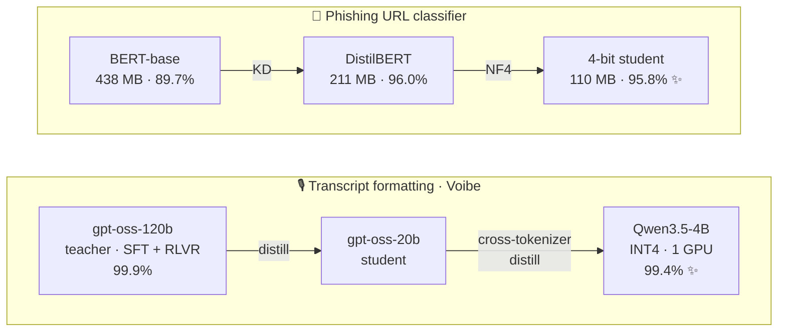
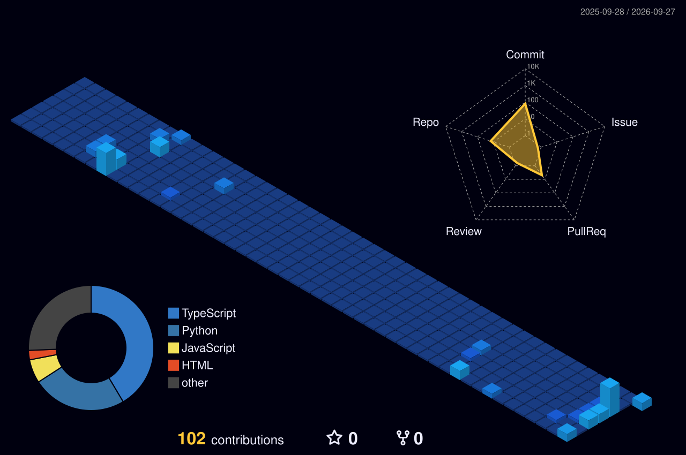

<!--
  ╭──────────────────────────────────────────────────────────────╮
  │  Akash Sakala · GitHub Profile README                          │
  │  Theme: GitHub Dark Minimal (bg #0d1117 · accent #58A6FF)      │
  │  Self-generated cards live in ./profile and ./profile-3d-contrib │
  │  (profile-cards.yml). Arcade + snake graphs live on the        │
  │  `output` branch (contribution-games.yml).                     │
  ╰──────────────────────────────────────────────────────────────╯
-->

<!-- ░░░ HEADER ░░░ -->


<div align="center">

<a href="https://github.com/Akash-Sakala">
  
</a>

<p><em>Associate Applications Developer @ Oracle · B.E. AI &amp; ML, BMSCE '26 · Bengaluru, India</em></p>

<a href="https://www.linkedin.com/in/akash-s-s/"></a>
<a href="https://huggingface.co/Akash-Sakala"></a>
<a href="https://leetcode.com/u/Akash_SS/"></a>
<a href="mailto:akashsakala04@gmail.com"></a>


</div>

<br />

<!-- ░░░ ABOUT ░░░ -->
### &nbsp;  &nbsp; About Me

```yaml
name:         Akash Sakala
now:          Associate Applications Developer @ Oracle   # Java · Spring Boot
before:       AI Research Intern @ Voibe (voice AI) · SDET Intern @ Netradyne
degree:       B.E. AI & ML · B.M.S. College of Engineering · 2026 · CGPA 9.73/10
after_hours:  fine-tuning · knowledge distillation · quantization · RLVR · ASR
motto:        make it work, make it right, make it small
```

By day I write Java and Spring Boot at **Oracle**. The rest of the time I take large models and make them small enough to actually ship.

At **Voibe** I distilled a **120B** teacher LLM into a **4B** student (**~30× smaller**) that scores **99.4%** against the teacher's **99.9%**. Serving went from a multi-GPU MoE deployment to **one INT4 GPU**. I also cut Whisper's WER on Indian-English speech from **9.16% to 4.51%** with a 42 MB LoRA adapter. Before that, as an **SDET intern at Netradyne**, I built a pySerial/Linux framework that brought IoT flashing + OTA installs down from **2.5 hours to 40 minutes**. Two teams (32+ engineers) now use it.

<br />

<!-- ░░░ RIGHT NOW ░░░ -->
### &nbsp; 🟢 &nbsp; Right Now

- 💼 &nbsp; Building enterprise software at **Oracle** with **Java + Spring Boot**
- 🧪 &nbsp; After hours: post-training small models, including **RLVR alignment, cross-tokenizer distillation and efficient inference**
- 🔊 &nbsp; Latest ship: **[Audio CNN](https://github.com/Akash-Sakala/audio-cnn)**, a sound classifier that scores higher than human listeners on ESC-50 (91.3% vs 81.3%)
- 💬 &nbsp; Ask me about **PyTorch, LoRA/QLoRA, LangGraph agents, or fitting big models onto small hardware**

<br />

<!-- ░░░ FEATURED PROJECTS ░░░ -->
### &nbsp; 🚀 &nbsp; Featured Projects

| Project | What it does | Stack |
| :--- | :--- | :--- |
| 🔊 **[Audio CNN](https://github.com/Akash-Sakala/audio-cnn)** <br/><sub>[🤗 model](https://huggingface.co/Akash-Sakala/audio-cnn-resnet34-esc50)</sub> | ResNet-34 that classifies **50 environmental sounds**. Accuracy went from 83.0% to **91.3% ± 1.3** (5-fold CV) with ImageNet→spectrogram transfer learning, SpecAugment and EMA. A GPU-resident bf16 pipeline cut training from **48 to 2.2 min**. Runs offline on CPU, and a dashboard shows **37 layer-wise feature maps** so you can see what each layer "hears". | `PyTorch` `Modal` `FastAPI` `Next.js` |
| 🤖 **[Kriya AI](https://github.com/Akash-Sakala/Kriya-AI)** | Autonomous **5-agent** app builder CLI (plan → design → code → test → debug) that turns a plain-English prompt into a working app. Includes a self-healing test-and-repair loop, cross-model fallback, SQLite checkpoint/resume and per-agent latency and token tracing. | `LangGraph` `Python` `Groq` |
| 🏫 **[Edu-Streamliners](https://github.com/Akash-Sakala/Edu-streamliners)** | School platform where teachers ask questions in plain English instead of writing database queries. Adds a Gemini-powered lesson planner and offline attendance and grading, and ships in Docker so it runs on a single offline machine. | `Node.js` `React` `MongoDB` `Docker` |
| 🩺 **[Chethana AI](https://github.com/Akash-Sakala/Chethana_AI)** | ML healthcare web app that predicts **42 diseases** from symptoms and generates medication, diet and workout plans. Also finds nearby clinics with Mapbox and sends Twilio SMS reminders. | `Flask` `scikit-learn` `SQLite` |

<details>
<summary>🧰 &nbsp;<b>More from the workshop</b>: side quests, hackathon builds and learning projects</summary>
<br/>

| Repo | Notes |
| :--- | :--- |
| [AgriQNet](https://github.com/Akash-Sakala/AgriQNet) | Agriculture assistant app (TypeScript · Vite) with a pest-detection service |
| [agri-rag](https://github.com/Akash-Sakala/agri-rag) · [pest_detection_yolo](https://github.com/Akash-Sakala/pest_detection_yolo) · [agro_backend](https://github.com/Akash-Sakala/agro_backend) | The Python services behind it: RAG for farming queries, a YOLO pest detector and the API backend |
| [own-web-server](https://github.com/Akash-Sakala/own-web-server) | An HTTP web server built from scratch in Python |
| [PyGit](https://github.com/Akash-Sakala/PyGit) | Git internals, explored in Python |
| [node-email-service](https://github.com/Akash-Sakala/node-email-service) | Plug-and-play Nodemailer email plugin for any Node.js app |
| [weather-app](https://github.com/Akash-Sakala/weather-app) | React + TypeScript + Tailwind weather app, Dockerized |
| [ai-mentor-saas-app](https://github.com/Akash-Sakala/ai-mentor-saas-app) | Next.js AI-mentor SaaS experiment |
| [voice-cloning](https://github.com/Akash-Sakala/voice-cloning) | Voice-cloning assignment for Voibe |

</details>

<div align="center">
  <a href="https://github.com/Akash-Sakala?tab=repositories"></a>
</div>

<br />

<!-- ░░░ HUGGING FACE ░░░ -->
### &nbsp; 🤗 &nbsp; Hugging Face: The Model Lab

I mostly work on **specializing models for production and local inference**. Here are the family trees:



| Model | Task | Highlight |
| :--- | :--- | :--- |
| **[qwen3.5-4b-transcript-formatter-lora](https://huggingface.co/Akash-Sakala/qwen3.5-4b-transcript-formatter-lora)** | Transcript formatting | Distilled 4B student, **99.4%** vs 120B teacher's 99.9% |
| [gpt-oss-20b](https://huggingface.co/Akash-Sakala/gpt-oss-20b-transcript-formatter-lora) · [gpt-oss-120b](https://huggingface.co/Akash-Sakala/gpt-oss-120b-transcript-formatter-lora) · [flan-t5-large](https://huggingface.co/Akash-Sakala/flan-t5-large-transcript-formatter) | Transcript formatting | Teacher → intermediate → baseline in the same lineage |
| **[whisper-small-emotion](https://huggingface.co/Akash-Sakala/whisper-small-emotion)** | Speech recognition | LoRA on Indian-English + expressive speech: WER **9.16% → 4.51%**, 42 MB adapter |
| [whisper-large-v3-svarah-indic](https://huggingface.co/Akash-Sakala/whisper-large-v3-svarah-indic) | Speech recognition | QLoRA (4-bit NF4) on AI4Bharat's Svarah, ~1% of params trained |
| **[bert-phishing-classifier_student_4bit](https://huggingface.co/Akash-Sakala/bert-phishing-classifier_student_4bit)** | Text classification | Distil-then-quantize: **4× smaller** than the teacher, higher accuracy |
| **[audio-cnn-resnet34-esc50](https://huggingface.co/Akash-Sakala/audio-cnn-resnet34-esc50)** | Audio classification | **93.25%** top-1 on held-out fold, ~57 ms per clip on CPU |
| [phishing-site-classification](https://huggingface.co/datasets/Akash-Sakala/phishing-site-classification) · [transcript-formatter-curriculum](https://huggingface.co/datasets/Akash-Sakala/transcript-formatter-curriculum) | Datasets | Training data behind the models above |

<div align="center">
  <a href="https://huggingface.co/Akash-Sakala"></a>
</div>

<br />

<!-- ░░░ TECH STACK ░░░ -->
### &nbsp; 🛠️ &nbsp; Tech Stack

<div align="center">

**Languages**


**AI / ML**

<br/>


**Backend & Web**


**Data, Cloud & ML Infra**

<br/>


</div>

<br />

<!-- ░░░ GITHUB STATS ░░░ -->
### &nbsp; 📊 &nbsp; GitHub Stats

<div align="center">

<!-- stats.svg + top-langs.svg are generated daily by .github/workflows/profile-cards.yml -->




</div>

<br />

<!-- ░░░ CONTRIBUTIONS, BUT MAKE IT FUN ░░░ -->
### &nbsp; 🕹️ &nbsp; Contributions, But Make It Fun

<div align="center">

<!-- 3D skyline, generated daily by profile-cards.yml -->


<!-- Pac-Man eats my commits, generated by contribution-games.yml -->
<picture>
  <source media="(prefers-color-scheme: dark)" srcset="https://raw.githubusercontent.com/Akash-Sakala/Akash-Sakala/output/pacman-contribution-graph-dark.svg" />
  <source media="(prefers-color-scheme: light)" srcset="https://raw.githubusercontent.com/Akash-Sakala/Akash-Sakala/output/pacman-contribution-graph.svg" />
  
</picture>

</div>

<details>
<summary>🪙 &nbsp;<b>Insert coin</b> for more games</summary>
<br/>
<div align="center">

**🧱 Breakout**

<picture>
  <source media="(prefers-color-scheme: dark)" srcset="https://raw.githubusercontent.com/Akash-Sakala/Akash-Sakala/output/breakout-contribution-graph-dark.svg" />
  <source media="(prefers-color-scheme: light)" srcset="https://raw.githubusercontent.com/Akash-Sakala/Akash-Sakala/output/breakout-contribution-graph.svg" />
  
</picture>

**🐍 Snake**

<picture>
  <source media="(prefers-color-scheme: dark)" srcset="https://raw.githubusercontent.com/Akash-Sakala/Akash-Sakala/output/github-contribution-grid-snake-dark.svg" />
  <source media="(prefers-color-scheme: light)" srcset="https://raw.githubusercontent.com/Akash-Sakala/Akash-Sakala/output/github-contribution-grid-snake.svg" />
  
</picture>

</div>
</details>

<br />

<!-- ░░░ LEETCODE ░░░ -->
### &nbsp; 🧩 &nbsp; LeetCode

<div align="center">
  <a href="https://leetcode.com/u/Akash_SS/"></a>
</div>

<br />

<!-- ░░░ TWO TRUTHS AND A LIE ░░░ -->
### &nbsp; 🎲 &nbsp; Two Truths and a Lie

1. A 4B model I distilled comes within half a point of its 120B teacher.
2. My sound classifier scores higher than human listeners on ESC-50.
3. I have never seen `CUDA out of memory`.

<details>
<summary>🤔 &nbsp;Reveal the lie</summary>
<br/>

**#3.** I see it about once a day. It's the reason I started caring about quantization. 🙃

</details>

<details>
<summary>😄 &nbsp;Today's dev joke</summary>
<br/>

</details>

<br />

<!-- ░░░ FOOTER ░░░ -->
<div align="center">

### &nbsp; 🤝 &nbsp; Let's Connect

Always happy to talk distillation, small models, or anything that runs faster than it should.

<a href="https://www.linkedin.com/in/akash-s-s/"></a>
<a href="https://huggingface.co/Akash-Sakala"></a>
<a href="mailto:akashsakala04@gmail.com"></a>

<sub>✨ <em>"Make it work, make it right, make it small."</em></sub>

</div>


